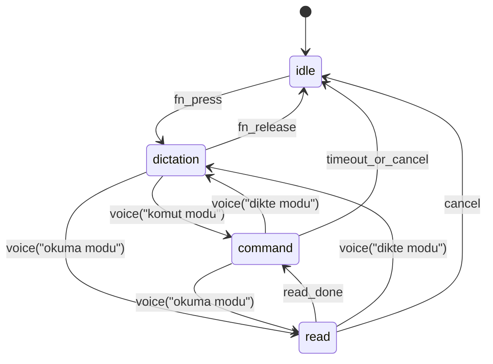

# State Machine (MVP)

## Event Contract

- `fn_press`: start session + audio streaming
- `fn_release`: finalize transcript + stop audio
- `voice(command)`: parsed by `IntentParser`
- `timeout_or_cancel`: 5s silence or explicit `iptal`

## Execution Rules

1. Only one active mode at a time.
2. Command mode never writes text directly.
3. Dictation mode only executes explicit command words (`gönder`, `iptal`) as actions.
4. Read mode is non-destructive; no keyboard/mouse events.

## Error Handling

- Unknown command:
  - Feedback: `Anlaşılmadı`
  - Remain in current mode
- Action failure:
  - Feedback with reason (`odaklanmış metin alanı yok`, `uygulama bulunamadı`)
  - Return to `command` mode
